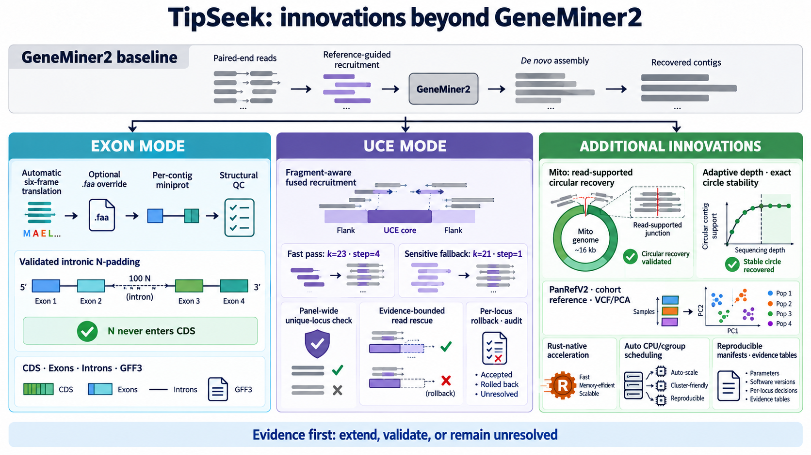

<p align="center">
  
</p>

# TipSeek

[](https://github.com/GUIBA-EX/TipSeek/actions/workflows/ci.yml)
[](https://github.com/GUIBA-EX/TipSeek/actions/workflows/codeql.yml)
[](https://github.com/GUIBA-EX/TipSeek/releases/latest)
[](rust-toolchain.toml)
[](LICENSE)

**[English](README_EN.md)** · [更新记录](CHANGELOG.md) · [报告问题](https://github.com/GUIBA-EX/TipSeek/issues)

TipSeek 是面向短读长测序数据的 Rust 原生工具包。它通过统一入口完成参考引导的 reads 招募、目标序列组装、证据汇总和 cohort 分析，适用于 genome skimming、target capture、核基因家族、UCE、动物线粒体、RAD 补充及无参考 repeatome。发布版运行时不依赖 Python。

## 相比 GeneMiner2

TipSeek 保留了源自 GeneMiner2 的参考引导 gene candidate 核心，并在统一入口下增加三组相互独立的能力。Exon 模式提供自动蛋白参考、结构注释，以及仅在 intron 内通过验证后才接受的补 N；UCE 模式提供 fragment-aware 融合招募、自动敏感 fallback、panel-wide unique-locus 验证和可逐 locus 回滚的 reads rescue。其他原生流程涵盖线粒体闭环验证、PanRefV2/群体分析、RAD 补充、profiling 和 repeatome。各路线共享资源调度、manifest 和证据表，但不混用各自的生物学接纳标准。



## 工作流

下表中的 `tipseek` 指构建后的 `cli/tipseek`。

| 目标 | 命令 | 主要输出 |
| --- | --- | --- |
| 核基因家族候选恢复 | `tipseek`（默认 `gene` 模式） | 逐样本候选和跨样本 family 汇总 |
| Exon/intron 结构注释 | `tipseek --assembly-mode exon` | 基因候选、CDS、exon、intron 和 supercontig |
| UCE core 与 reads 支持的侧翼 | `tipseek --assembly-mode uce` | UCE contig、恢复汇总和逐 locus 证据 |
| 动物线粒体恢复 | `tipseek mito` | closed、linear 或 ambiguous 结构判定 |
| Marker 支持度评估 | `tipseek profiling` | 每条参考序列的 reads 支持 |
| UCE 群体分析 | `tipseek population` | cohort reference、VCF、PCA 等 |
| WGS 补充 RAD 矩阵 | `tipseek rad-probe` → `tipseek rad` → `tipseek rad-validate` | 双 arm 恢复和严格矩阵 |
| 无参考 repeatome | `tipseek te` | repeat library、注释和 RPM |

所有工作流共享输入校验、CPU 调度和运行状态记录，但使用各自的生物学判据。UCE 路径采用 fragment-aware 分层招募、核心与末端的独立证据预算、PE-supported 双图组装和逐 locus 可逆 rescue；其他工作流只执行其推断目标所需的步骤。

## 安装

完整依赖和平台说明见[命令行指南](manual/ZH_CN/command_line.md)。从源码构建：

```bash
git clone https://github.com/GUIBA-EX/TipSeek.git
cd TipSeek
cargo run -p xtask -- build
cli/tipseek -h
```

构建结果位于 `cli/`，并包含 `SHA256SUMS` 和 `SBOM.spdx.json`。

## 快速开始

样本表使用 tab 分隔，每行为 `sample_id  R1  [R2]`。建议使用绝对路径。

```text
sample_1<TAB>/data/sample_1_R1.fastq.gz<TAB>/data/sample_1_R2.fastq.gz
sample_2<TAB>/data/sample_2_R1.fastq.gz<TAB>/data/sample_2_R2.fastq.gz
```

参考目录中每个 FASTA 文件定义一个 gene family 或 UCE locus。

```bash
# 默认：恢复核基因家族候选
cli/tipseek -f samples.tsv -r family_references -o gene_out -p auto

# 默认从核酸 bait 自动翻译参考，再进行 exon/intron 注释
cli/tipseek --assembly-mode exon \
  -f samples.tsv -r family_references \
  -o exon_out -p auto
```

仅恢复 UCE contig：

```bash
cli/tipseek filter assemble \
  -f samples.tsv \
  -r uce_references \
  -o uce_out \
  -p auto \
  --assembly-mode uce
```

UCE 模式默认使用 k=23、step=4、`auto` 招募和一轮 evidence-constrained rescue。可用 `--no-uce-rescue-reads` 关闭 rescue，或用 `--uce-rescue-rounds 2` 请求第二轮。完整参数见[命令行指南](manual/ZH_CN/command_line.md#73-组装与-uce)。

UCE 结果应首先检查：

- `<sample>/uce_assembly_summary.csv`：逐 locus 恢复状态与支持指标；
- `<sample>/results/`：最终接受的 contig；
- `<sample>/uce_recruit_passes.tsv` 和 `<sample>/uce_recruit_contig_probe_gate.tsv`：招募来源、probe 门控与候选状态；
- `<sample>/uce_rescue_rounds.csv` 和 `<sample>/uce_rescue_summary.csv`：每轮接纳、裁切或回滚结果。

## 证据与结果边界

- TipSeek 的组装与 rescue 以 reads 证据为准；UCE rescue 不使用参考序列填补缺口，review-only core 也不会作为 rescue 起点。
- `gene` 与 `exon` 中的候选数是组装证据，不等同于等位基因数或真实生物学拷贝数。
- `mito` 面向常规单环动物线粒体。超过 insert size 的完全重复不能由短 reads 可靠确定拷贝数，结果会保留为 linear 或 ambiguous。
- `profiling` 报告 reads 与参考序列的相容性，不等同于物种鉴定或丰度估计。
- RAD 的 R1/R2 是独立限制性位点 arms；WGS 恢复本身不能证明 allele dropout，应以 `rad-validate` 的双 arm 检查为准。

## 可复现运行

- `workflow_manifest.tsv` 记录命令、版本、关键参数、参考与样本表 SHA-256，以及输入 reads 元数据。
- `workflow_status.tsv` 原子记录 `succeeded` 或 `failed`；`--resume` 只在输入、参数和成功状态完全一致时返回已有结果。
- `--workflow-profile` 仅记录时间与 I/O，不改变分析；`--cleanup-dry-run` 可在删除可再生中间文件前生成审核清单。

## 文档

| 内容 | 中文 | English |
| --- | --- | --- |
| 安装、输入与参数 | [命令行指南](manual/ZH_CN/command_line.md) | [Command-line guide](manual/EN_US/command_line.md) |
| 输出目录与结果表 | [输出说明](manual/ZH_CN/output.md) | [Output reference](manual/EN_US/output.md) |
| Filter 与缓存 | [Filter](docs/filter_ZH.md) | [Filter](docs/filter_EN.md) |
| Gene、exon 与 UCE 组装 | [Assembler](docs/assembler_ZH.md) | [Assembler](docs/assembler_EN.md) |
| 线粒体 | [Mito](docs/mitochondria_CN.md) | [Mito](docs/mitochondria_EN.md) |
| Gene、exon、RAD、TE | [Gene](docs/gene_ZH.md) · [Exon](docs/exon_ZH.md) · [RAD](docs/rad_CN.md) · [TE](docs/te_ZH.md) | [Gene](docs/gene_EN.md) · [Exon](docs/exon_EN.md) · [RAD](docs/rad_EN.md) · [TE](docs/te_EN.md) |
| Population 与 profiling | [Population](docs/population_ZH.md) · [Profiling](docs/profiling_ZH.md) | [Population](docs/population_EN.md) · [Profiling](docs/profiling_EN.md) |

## 引用与许可

使用 GeneMiner2 衍生的 gene assembler 时，还请引用：Yu XY, Tang ZZ, Zhang Z, Song YX, He H, Shi Y, Hou JQ, Yu Y. 2026. **GeneMiner2**: Accurate and automated recovery of genes from genome-skimming data. *Molecular Ecology Resources* 26:e70111. [doi:10.1111/1755-0998.70111](https://doi.org/10.1111/1755-0998.70111)

TipSeek 以 [GPL-3.0-or-later](LICENSE) 发布；第三方与移植代码的来源见 [NOTICE](NOTICE)。
