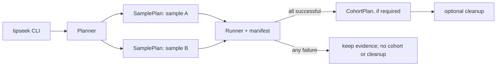

# Workflow orchestration architecture (incremental)

[中文](workflow-architecture.md)

> This development note records the orchestration design and implementation boundaries. User-facing commands, defaults, and outputs are defined by the [command-line guide](../../manual/EN_US/command_line.md) and [output reference](../../manual/EN_US/output.md). The sections below distinguish current behavior from design targets.

## Goals

Preserve existing commands, result layouts, and filtering/assembly semantics while turning the CLI from a command-string builder into a verifiable workflow planner. Native Rust components continue to implement the algorithms; external programs remain explicit optional adapters.

TipSeek does not need a general DAG engine. Its workflows are linear per-sample stages followed by an optional cohort stage. Modeling that structure directly is smaller, easier to audit, and sufficient for rescue, validation, and cleanup.

## Single entry point

`tipseek` parses options, validates inputs, creates a plan, executes samples concurrently, and runs cohort, validation, and cleanup stages after success. It must not depend on a component's internal argument format.

The planner first creates a `SamplePlan` containing an ordered list of `Stage` values, then zero or one `CohortPlan`. Every stage uses the same contract:

```text
Stage {
  id, scope(sample | cohort),
  inputs, outputs,
  component, arguments, resources,
  completion_check
}
```

Stages run in list order. `completion_check` verifies that declared outputs exist and are readable instead of treating a zero process exit code as sufficient evidence. `CohortPlan` runs only after every sample plan succeeds; a failed run must not produce an apparently complete cohort summary.

These fields are not free-form strings in the implementation. `Component`, `ArtifactKind`, `Scope`, and `CleanupPolicy` are enums; paths use `PathBuf`; arguments use `Vec<OsString>`. Only component adapters map a `Component` to a binary under `cli/bin`, preventing shell reinterpretation of user options, sample names, or paths containing spaces.

## Call graph



## Stage artifacts

Each `Stage` consumes and produces named `Artifact` values instead of relying on directory conventions:

```text
Reference | CandidateReads | FilteredReads | ContigSet
MitoEvidence | GeneCalls | RadMatrix | Report
```

The component registry declares permitted input and output types. For example, `refilter` can only transform `CandidateReads` into `FilteredReads`, while `mito finalize` requires both a `ContigSet` and the matching `FilteredReads`. Before execution, the planner checks types and paths so a previous round, another sample, or an incompatible directory cannot silently enter a downstream stage.

## Canonical workflows

```text
gene (default) / exon
  MainFilter -> refilter -> original-rust -> gene classify/cohort
  exon only: -> miniprot annotation/structural validation

UCE (default)
  ucefilter -> uce-rust -> rescue (one round by default; optional disable/second round)

UCE (compatibility route)
  MainFilter -> refilter -> uce-rust -> rescue (one round by default; optional disable/second round)

mito
  mito reference -> MainFilter -> collapse-baits -> text refilter -> uce-rust
  -> seed-contig rescue (when available) -> finalize -> circularity evidence

RAD
  probe (imported or de novo) -> MainFilter -> refilter -> original-rust
  -> RAD finalize -> optional validate
```

`MainFilter + refilter` is the general multi-bait candidate-read route. The default UCE `ucefilter` path is its fused, UCE-specific alternative. A plan must never mix the two implicitly.

| Workflow | Workflow-level stages | Per-sample stages | After all samples succeed |
| --- | --- | --- | --- |
| gene (default) | Build or reuse the MainFilter dictionary | `MainFilter → refilter → original-rust → classify` | `gene cohort` |
| exon | Build or reuse the MainFilter dictionary | `MainFilter → refilter → original-rust → classify` | `gene cohort → miniprot annotation/structural validation`, then optional resolve/tree |
| UCE default | None | `ucefilter fast → fallback → uce-rust → rescue (one round by default)` | combine/tree |
| UCE compatibility | Build or reuse the MainFilter dictionary | `MainFilter → refilter → uce-rust → rescue (one round by default)` | combine/tree |
| mito | `prepare-reference`, then build or reuse the dictionary | `MainFilter → collapse-baits → text refilter → uce-rust → seed rescue (when available) → finalize` | None; each sample reports circular or retained linear evidence independently |
| RAD | `probe`, then build or reuse the MainFilter dictionary | `MainFilter → refilter → original-rust` | `rad finalize`, then optional validate |

## Orchestration boundaries

The CLI selects a workflow and asks `Planner` to create its stages. `Planner` is the only layer allowed to select components or construct component arguments. `Runner` only executes, records, and validates stages, while domain components process their own inputs. This prevents `mito`, `gene`, and `rad` from duplicating MainFilter/refilter/assembler orchestration.

## Component layers

```text
tipseek-cli
  Planner: select a canonical workflow and create SamplePlan + CohortPlan
  Runner: concurrency, failure aggregation, profile, resume, cleanup
  Registry: component names, capabilities, I/O contracts, versions

native components
  MainFilterNew | main_refilter_new | uce_filter
  main_assembler-original-rust | main_assembler-rust
  mito_workflow | gene_workflow | rad_workflow | build_consensus

optional adapters
  MAFFT / IQ-TREE / ASTRAL, etc.; inputs and outputs must enter the manifest
```

The first stage does not split existing crates or change the `cli/bin` layout. It introduces only the `Component` registry and `Stage` model, making the current `run(binary, args)` path the single component launcher.

## Result states

The current Runner writes only two terminal execution states to `workflow_status.tsv`: `succeeded` or `failed`, with `error_kind` attached to failures. Domain result tables express scientific incompleteness, such as mitochondrial linear/ambiguous, exon unresolved, and UCE review/revert states. Those records are not deleted because the top-level command failed. Adding a distinct `scientifically_incomplete` orchestration state in the future would require a versioned manifest schema and must not silently change existing batch semantics.

## Artifacts and resume

The current CLI atomically writes `workflow_manifest.tsv` and `workflow_status.tsv` at the output root. The manifest records schema/tool versions, command, assembly mode, CPU source, reference and sample-manifest SHA-256 values, original arguments, and each reads file's absolute path, size, and modification time. The status file records success/failure and the error category.

```text
workflow_manifest.tsv: field, value
workflow_status.tsv: schema_version, state, error_kind, commands, error
```

Current `--resume` reuses only an entire successful workflow: the recomputed manifest must match byte-for-byte and the existing status must be `succeeded`; otherwise reuse is rejected. It is not an arbitrary stage checkpoint and does not skip work merely because the target directory exists. A stage-level typed manifest remains a future design target.

Caches apply only to pure stages: MainFilter dictionaries, mitochondrial bait/reference preparation, and assembler reference caches. A key must include content SHA-256, relevant options, component version, and format version. Filtered sample reads are never reused across samples. Cache writes use a temporary directory followed by an atomic rename; entries left by failed or interrupted runs never count as hits.

## Concurrency and resources

The first migration version preserves current `-p` semantics: it controls the number of concurrent `SamplePlan` workers, while native filtering and assembly stages remain explicitly single-threaded and do not create a second concurrency layer. A later version may add `--stage-threads` for native components that explicitly support it, with values declared by `ResourceRequest`. The global budget must satisfy:

```text
sum(stage.threads) <= --stage-threads
sum(stage.memory_mib) <= --memory-limit-mib (when set)
```

This avoids oversubscription from multiplying sample workers by child-tool threads. Outputs remain isolated by sample, and cohort inputs and summaries are sorted by sample name for reproducibility.

## Cleanup

`Runner` performs cleanup only after the complete plan succeeds; components never delete their own intermediates. Each `Stage` declares removable intermediate artifacts and their final consumer. `Runner` writes `cleanup_manifest.tsv` before deleting items one by one and marks completed removals. Final results, raw reads, references, summaries, and diagnostic reports are never eligible for cleanup.

## Migration order

1. Introduce `Component`, `Stage`, and the manifest while calling existing functions; keep outputs byte-identical.
2. Parameterize the shared `MainFilter -> refilter -> assembler` plan used by default/compatibility UCE, gene, and RAD routes.
3. Express mitochondrial prepare/recruit/refilter/assemble/finalize as the same linear stage plan while retaining its specialized stopping and circularity evidence.
4. Compare old orchestration with the new plan on identical inputs, checking filtered FASTQ files, contigs, summaries, and exit conditions individually.
5. Remove duplicated argument-building functions only after comparison coverage exists; do not migrate algorithms or force a workspace restructuring.

## Non-goals

- Do not introduce microservices, a database, or an implicit background daemon.
- Do not force all candidate results into one format.
- Do not change canonical k-mers, filtering thresholds, assembly selection, circularity decisions, or output ordering as a side effect of orchestration work.
- Do not make MAFFT, IQ-TREE, or ASTRAL hard dependencies of the execution core.
