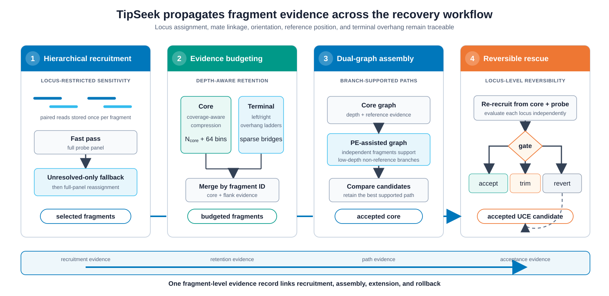
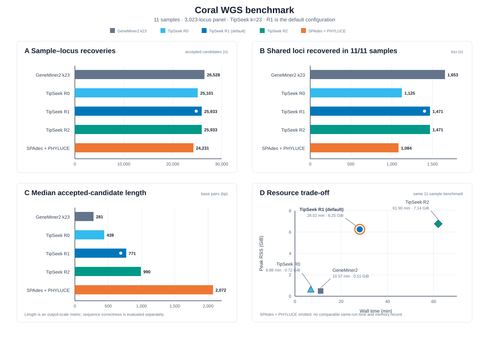

# TipSeek: fragment-aware, evidence-bounded recovery of ultraconserved elements from short reads

**中文标题：** TipSeek：片段感知、证据约束的超保守元件恢复

**Original Paper | Genome analysis**

**Authors:** X1,*

1 X

*Corresponding author. X. E-mail: X.

## Abstract

**Motivation:** 超保守元件（ultraconserved elements，UCEs）的保守核心产生密集且可能跨 locus 共享的 reads，系统发育信息更丰富的侧翼则依赖少量跨越 probe 边界的 fragments。恢复算法既要压缩核心冗余，也要保留连接 core 与 flank 的稀疏 fragment evidence。TipSeek 在招募、核心组装和侧翼延伸之间持续传递 fragment-level evidence：它只对未恢复 loci 提高招募敏感度，为饱和核心和稀疏末端分别分配证据预算，并通过 core/PE-assisted 双图与逐 locus 回滚控制延伸。

**Results:** 在 11 个珊瑚 WGS 样本和 3,023-locus OCTO-V2 UCE/exon 面板上，TipSeek 默认配置获得 25,933 个 sample–locus recoveries，候选序列中位长度为 771 bp；GeneMiner2 *k*=23 获得 26,528 个 recoveries，中位长度为 281 bp；SPAdes + PHYLUCE 获得 24,231 个 recoveries，中位长度为 2,072 bp。TipSeek 第一轮 rescue 同时提高跨样本恢复完整度和候选长度，第二轮则主要延长已有候选。因此，*k*=23 与一轮 rescue 被设为当前默认配置。

**Availability and implementation:** TipSeek 以 Rust 实现，采用 GPL-3.0-or-later 许可证。源代码与 v1.6.2 发布版分别见 https://github.com/GUIBA-EX/TipSeek 和 https://github.com/GUIBA-EX/TipSeek/releases/tag/v1.6.2；本文 benchmark 使用的 Git commit 为 d46ab9d，测试数据和永久 DOI 为 X。

**Keywords:** ultraconserved elements; target-restricted assembly; genome skimming; paired-end reads; phylogenomics; coral

## 1 Introduction

UCE 的保守核心支持跨较深进化尺度识别同源位点，其侧翼通常包含更多变异，可用于较浅层级的系统发育推断（Faircloth et al. 2012, Smith et al. 2014）。这一核心—侧翼结构同时产生高深度核心、跨 locus 共享命中和低深度侧翼。恢复算法需要压缩核心冗余，并保留跨越 probe 边界的 fragments，使 locus 归属和 reads 支持能够延续到侧翼组装。

现有方法主要通过全局组装或参考引导招募缩小搜索空间。PHYLUCE 先使用 SPAdes 构建 contigs，再按 probe 提取目标序列（Bankevich et al. 2012, Faircloth 2016）；该 assembly-first 路径已用于从珊瑚 genome-skimming 数据恢复 OCTO-V2 UCE 和 exon loci（Quattrini et al. 2024）。GeneMiner 和 GeneMiner2 则先招募目标相关 reads，再逐 locus 组装（Xie et al. 2024, Yu et al. 2026）。对于 UCE 数据，算法还需决定何时扩大招募范围、如何在核心 reads 饱和时保留稀疏侧翼证据，以及如何限制弱支持分支在迭代延伸中的累积。这些决策共同改变恢复量、候选长度和计算成本（Bossert et al. 2024）。

TipSeek 将 UCE 恢复建模为连续的 fragment-level evidence propagation。分层招募先限定需要提高敏感度的 loci，再恢复完整 probe 面板上的歧义判定；结构感知的证据预算分别控制核心覆盖和末端重叠链；双图组装与可逆 rescue 依据 paired-end（PE）分支支持、reads 密度和结构证据接纳或回滚延伸。本次发布聚焦 UCE recovery 模块，描述其算法，并在 11 个珊瑚 WGS 样本上比较 TipSeek、GeneMiner2 和 PHYLUCE 的恢复量、候选长度与资源消耗。

## 2 Materials and methods

### 2.1 Fragment-aware hierarchical recruitment

TipSeek 将同一 read pair 视为一个 fragment。任一 mate 命中参考面板后，完整 fragment 在共享 fragment bank 中存储一次，两个 mates 共同提供 locus、方向、参考位置和末端 overhang 证据。UCEFilter 使用 canonical rolling k-mers、blocked Bloom filter 和精确哈希表完成初筛，并为每个 locus 的正反向参考建立 FM-index，以 maximal exact match 和 run-based orientation 复核候选（Bloom 1970, Ferragina and Manzini 2000, Putze et al. 2009）。

默认 `auto` 模式首先执行快速招募，仅对没有 selected fragments 的 loci 再扫描 FASTQ。敏感阶段的 locus 子集只作为粗招募门控；通过门控的 fragments 随后返回完整 probe 面板进行多 locus 判定。fallback-only contig 需通过 probe coverage、identity、近似并列 locus、长倒置重复和内部无支持 gap 检查，才能成为 rescue-eligible core。未通过接纳条件的候选分别记录为 ambiguous、review 或 rejected，而不进入后续延伸。完整阈值见 Supplementary Methods S1。

### 2.2 Topology-aware evidence budgeting

当候选 fragments 达到饱和条件时，TipSeek 对核心证据和末端证据分别分配预算。设合格 fragment 数为 *N*、有效参考长度为 *L*eff、平均 fragment 碱基数为 *b̄*，核心预算为

`N_core = min[N, max(512, ceil(80L_eff / b̄), ceil(0.60N))]`。

核心 fragments 按 locus 特异性、maximal exact match、aligned mates 和稳定 fragment ID 排序，再以 64-bin 配额维持参考跨度。terminal fragments 不参与同一深度截断，而是按左右侧和 overhang 长度建立独立保留阶梯。两类证据以 fragment 为原子合并后进入组装，使高深度核心的压缩不删除连接 core 与 flank 的低频重叠关系。

### 2.3 PE-supported dual-graph assembly and reversible rescue

`uce-rust` 从同一组 k-mer counts 构建两张参考锚定的加权 de Bruijn 图（Idury and Waterman 1995）。core graph 使用常规深度和参考证据；PE-assisted graph 还可接纳由至少两个独立 fragments 支持的低深度非参考 k-mers。paired-fragment support 只累计到真实分支边，并与参考连续性、局部深度和有限前瞻共同决定路径。两张图独立产生候选；如果 PE-assisted 候选短于已通过 QC 的 core 候选，最终结果保留 core path。

默认 rescue 使用已接受 core 与原参考重新招募 reads，并按 locus 独立执行 accept、trim 或 revert。该步骤采用 target-restricted iterative assembly 的 baiting 思路（Hahn et al. 2013, Allen et al. 2015）。第一轮依据 unique-read density、内部无支持 gap 和长倒置重复控制 whole-contig extension；可选第二轮只处理仍在增长的 loci，并要求新增末端同时满足支持 breadth、gap、独立 fragment 和 core-to-extension bridge 条件。任一 locus 的失败只回滚该 locus。TipSeek 将 fast/fallback 来源、fragment 预算、probe gate、rescue 轮次和回滚结果写入结构化表格，使最终候选可追溯至对应的 reads 和接纳规则。完整门控参数见 Supplementary Methods S1，整体证据流见 Figure 1。

**Figure 1. TipSeek 的 fragment-aware、evidence-bounded UCE recovery 流程。** Paired reads 以 fragment 为单位经过快速招募和 unresolved-only fallback；核心与末端证据分别分配预算后进入 core graph 和 PE-assisted graph；rescue 对每个 locus 独立执行 accept、trim 或 revert。底部证据轨迹表示 locus assignment、mate linkage、orientation、参考位置和 terminal overhang 在阶段间连续传递；虚线表示逐 locus 回滚。

### 2.4 Software implementation

TipSeek benchmark snapshot（Git commit d46ab9d）以 Rust 实现，统一入口为 `tipseek`。本文分析使用的 UCE 路径为 `UCEFilter fast pass → unresolved-only fallback → uce-rust → one-round rescue`。参考引导过滤、FM-index 和加权 de Bruijn 图是算法基础；TipSeek 的方法贡献是 fragment-level 状态传递、核心与末端的分离预算、PE/core 双候选路径及逐 locus 可逆延伸。软件安装、参数说明、测试数据和复现命令见 https://github.com/GUIBA-EX/TipSeek 与 Supplementary Methods S2。

### 2.5 Benchmark data and comparison design

benchmark 使用 You et al.（2026）公开的 12 个八放珊瑚 WGS 样本中的 11 个（CRR2698935、CRR2698936、CRR2698938–CRR2698946）；CRR2698937 因 X 未纳入预设分析集。参考面板为 OCTO-V2，由 29,181 条 probes 组成，共靶向 3,023 个 loci，包括 1,337 个 UCE loci 和 1,686 个 exon loci（Erickson et al. 2021）。主比较包括 GeneMiner2 *k*=23、TipSeek 默认配置（*k*=23、`auto`、一轮 rescue）以及 SPAdes X + PHYLUCE X genome-harvesting。TipSeek 内部比较包括 *k*=23 下的零、一和两轮 rescue，以及 *k*=31、`auto`、一轮 rescue。完整版本、命令和运行环境见 Supplementary Methods S2。

主要指标为 sample–locus recoveries、每样本候选数、面板独立位点数、shared loci、候选序列中位长度、wall time 和峰值 RSS。一个样本在一个 locus 获得被相应工作流接受的候选，计为一次 sample–locus recovery；面板独立位点指至少在一个样本中恢复的 loci，shared loci 分别按全部 11 个样本和至少 9 个样本恢复统计；长度中位数由全部 accepted sample–locus candidates 计算。GeneMiner2 与 TipSeek 使用同一批样本直接计时。PHYLUCE 的主分析报告恢复量和候选长度，其资源记录不参与比较。

### 2.6 Coral ground-truth validation

为区分候选长度与序列正确性，使用具有公开参考基因组的珊瑚 X 建立真值数据集。首先将 3,023-locus 面板与参考基因组比对，仅保留唯一定位且包含完整目标区间的 loci；随后以固定随机种子 X 模拟与实测数据一致的 paired-end reads，并设置低、中和高三个测序深度（X、X 和 X）。TipSeek、GeneMiner2 和 SPAdes + PHYLUCE 使用与 WGS benchmark 相同的参数运行。每条 accepted candidate 依据其最佳参考位置和覆盖范围判定 locus assignment，并统计正确 locus assignment 比例、序列一致性、嵌合或错误延伸比例及正确侧翼恢复长度。真值定义、模拟命令和逐 locus 结果见 Supplementary Methods S3 和 Supplementary Table S3。

## 3 Results

### 3.1 Recovery completeness, sequence length and resource use

GeneMiner2 获得 26,528 个 sample–locus recoveries，其中 1,653 个 loci 在全部 11 个样本中恢复；TipSeek 默认配置分别为 25,933 和 1,471。GeneMiner2 比 TipSeek 多获得 595 个 sample–locus recoveries（2.24%），TipSeek 的候选序列中位长度为 771 bp，是 GeneMiner2 的 2.74 倍。TipSeek 和 GeneMiner2 的 wall time 分别为 28.02 和 10.57 min，峰值 RSS 分别为 6.25 和 0.51 GiB。

SPAdes + PHYLUCE 获得 24,231 个 sample–locus recoveries，其中 1,084 个 loci 在全部样本中恢复，候选序列中位长度为 2,072 bp。相较 TipSeek，PHYLUCE 少获得 1,702 个 sample–locus recoveries，候选序列中位长度增加 1,301 bp。PHYLUCE 的比较限于恢复量和候选长度。

**Table 1. 三个工作流的五个配置在 11 个珊瑚 WGS 样本上的结果。**

| 配置 | Sample–locus recoveries | 每样本平均/中位数（范围） | 面板独立位点 | Shared loci（11/11） | Shared loci（≥9/11） | 长度中位数（bp） | Wall time（min） | 峰值 RSS（GiB） |
| --- | ---: | ---: | ---: | ---: | ---: | ---: | ---: | ---: |
| GeneMiner2 *k*=23 | 26,528 | 2,411.64/2,384（2,364–2,546） | 2,909 | 1,653 | 2,250 | 281 | 10.57 | 0.51 |
| TipSeek *k*=23，R0 | 25,101 | 2,281.91/2,262（2,173–2,464） | 2,881 | 1,125 | 2,050 | 439 | 6.88 | 0.72 |
| TipSeek *k*=23，R1 | 25,933 | 2,357.55/2,341（2,259–2,500） | 2,885 | 1,471 | 2,134 | 771 | 28.02 | 6.25 |
| TipSeek *k*=23，R2 | 25,933 | 2,357.55/2,341（2,259–2,500） | 2,885 | 1,471 | 2,134 | 990 | 61.90 | 7.14 |
| SPAdes + PHYLUCE genome-harvesting | 24,231 | 2,202.82/2,224（1,985–2,330） | 2,718 | 1,084 | 1,984 | 2,072 | — | — |

*Note:* R0、R1 和 R2 分别表示零、一和两轮 rescue。PHYLUCE 缺少同次、同核的完整计时与内存记录，因此不比较资源消耗。

TipSeek 内部比较确定了默认运行点。在一轮 rescue 下，*k*=23 比 *k*=31 增加 3,848 个 sample–locus recoveries（17.42%），候选序列中位长度分别为 771 和 752 bp。*k*=23 从 R0 到 R1 增加 832 个 sample–locus recoveries，并将中位长度从 439 bp 增至 771 bp；R2 不再增加 loci，将中位长度提高到 990 bp，同时把 wall time 从 28.02 min 增至 61.90 min。因此，*k*=23 和一轮 rescue 被设为当前默认值：第一轮同时增加恢复量和候选长度，第二轮主要延伸已有候选。完整六组结果见 Supplementary Table S1。

该 benchmark 直接量化恢复量、候选长度和计算资源，其中候选长度是输出尺度而非碱基准确率指标。TipSeek 的主要输出特征是在 target-restricted 路径中保留较长候选，并为每个候选提供从 fragment 招募到 rescue 接纳或回滚的证据记录。Figure 2 汇总了五个配置的恢复量、shared loci、候选长度及 TipSeek 与 GeneMiner2 的资源运行点。

**Figure 2. 三个工作流在 11 个珊瑚 WGS 样本上的恢复结果与计算权衡。** (A) sample–locus recoveries；(B) 在全部 11 个样本中恢复的 shared loci；(C) accepted candidates 的序列长度中位数；(D) GeneMiner2 与 TipSeek 配置在 wall time–峰值 RSS 平面上的运行点。白点和橙色外圈标记当前默认 TipSeek R1。SPAdes + PHYLUCE 因缺少同次、同核的完整记录而不进入资源面板。

### 3.2 Sequence correctness on the coral ground-truth dataset

在珊瑚真值数据集的低、中和高深度条件下，三个工作流分别获得 X、X 和 X 个可评分候选。TipSeek 默认配置的正确 locus assignment 比例为 X，候选序列一致性为 X，嵌合或错误延伸比例为 X，正确侧翼恢复长度中位数为 X bp；GeneMiner2 和 SPAdes + PHYLUCE 的对应结果见 Supplementary Table S3。该结果用于检验更长候选是否来自目标 locus 的受支持侧翼，而不将候选长度本身解释为准确性。

## 4 Discussion

R0 到 R1 的变化显示，第一轮 rescue 主要提高跨样本恢复完整度，而不是扩大参考面板中的位点范围。R1 比 R0 增加 832 个 sample–locus recoveries，但面板独立位点仅增加 4 个；与此同时，11/11 shared loci 增加 346 个，≥9/11 shared loci 增加 84 个，候选序列中位长度由 439 bp 增至 771 bp。第一轮 rescue 因而同时补回已有面板位点在部分样本中的缺失结果，并延伸 reads 支持的侧翼。

第二轮 rescue 的作用不同。R2 与 R1 的 sample–locus recoveries、面板独立位点和 shared loci 完全相同，仅将候选序列中位长度由 771 bp 提高到 990 bp，同时使 wall time 由 28.02 min 增至 61.90 min、峰值 RSS 由 6.25 GiB 增至 7.14 GiB。因此，R0 可作为资源优先的快速运行点，R1 兼顾恢复完整度、侧翼长度和计算成本，R2 则适用于优先延伸已有候选的任务；*k*=23 与一轮 rescue 据此作为当前默认配置。

三个工作流占据不同的输出区间。相较 GeneMiner2，TipSeek R1 少恢复 595 个 sample–locus recoveries、24 个面板独立位点和 182 个 11/11 shared loci，但候选序列中位长度增加 490 bp。相较 PHYLUCE，TipSeek R1 多恢复 1,702 个 sample–locus recoveries、167 个面板独立位点和 387 个 11/11 shared loci，而候选序列中位长度短 1,301 bp。GeneMiner2 的局部参考引导路径、PHYLUCE 的全局组装后提取路径和 TipSeek 的 target-restricted 路径由此形成恢复广度、跨样本完整度、序列长度和资源消耗之间的不同权衡（Bossert et al. 2024）。

TipSeek 的区别不在于单独增加一次 rescue，而在于 fragment evidence 在招募、预算、图路径选择和延伸之间连续传递。分层招募只为未恢复 loci 扩大搜索范围，核心—末端分离预算保留连接 core 与 flank 的低频 fragment 链，PE/core 双图与逐 locus 回滚再将这些证据转化为受支持的候选路径。表 1 中第一轮 rescue 对 shared loci 和候选长度的同步提升，以及第二轮只继续增加长度的结果，体现了这一 evidence-bounded recovery 过程的分阶段行为。

珊瑚真值验证进一步将输出尺度与序列正确性分开。在低、中和高深度条件下，TipSeek 的 locus assignment、序列一致性、错误延伸和正确侧翼恢复结果分别为 X；GeneMiner2 和 SPAdes + PHYLUCE 的对应结果为 X。该结果与实测 WGS benchmark 的恢复完整度和长度结果共同界定默认配置的运行点，而不依赖候选长度作为准确性的替代指标。

本次 UCE 论文确立了 TipSeek 的 fragment-level evidence framework。代码库还包含线粒体恢复、marker profiling、UCE 群体分析、核基因家族、RAD 矩阵补充和无参考 repeatome 等工作流。后续版本将完善这些已有功能并统一命令接口、结构化证据输出、测试、文档和可复现发布流程。由于各工作流具有不同的输入结构、推断目标和验证指标，其算法、任务特异性 benchmark 和适用范围将在功能完善后分别以独立论文报告。

## Acknowledgements

X

## Author contributions

X（按 CRediT taxonomy 填写）。

## Supplementary material

Supplementary Material 包含算法阈值、软件版本、完整命令、运行环境、样本与探针元数据、六组实测 benchmark 结果及珊瑚真值验证结果。

## Conflict of interests

X

## Funding

X

## Data availability

TipSeek 源代码：https://github.com/GUIBA-EX/TipSeek；v1.6.2 发布版：https://github.com/GUIBA-EX/TipSeek/releases/tag/v1.6.2。本文 benchmark 使用的 Git commit 为 d46ab9d；归档代码、测试数据与永久 DOI：X。软件采用 GPL-3.0-or-later 许可证。珊瑚 benchmark reads 为 CRR2698935、CRR2698936、CRR2698938–CRR2698946，来自 BioProject PRJCA057506（You et al. 2026）。OCTO-V2 bait set 归档于 https://doi.org/10.6084/m9.figshare.12061038；完整 benchmark 输出、真值验证材料和表格生成脚本的永久链接为 X。

## Ethics statement

本研究分析公开测序数据，未产生新的生物样本或测序数据，伦理审批不适用。

## AI disclosure

OpenAI Codex 用于协助手稿结构重组和语言编辑。作者核查了全部技术描述、数据、引用与结论，并对稿件内容负责。

## References

Allen JM, Huang DI, Cronk QC, Johnson KP. aTRAM—automated target restricted assembly method: a fast method for assembling loci across divergent taxa from next-generation sequencing data. *BMC Bioinformatics* 2015;16:98. https://doi.org/10.1186/s12859-015-0515-2

Bankevich A, Nurk S, Antipov D, et al. SPAdes: a new genome assembly algorithm and its applications to single-cell sequencing. *Journal of Computational Biology* 2012;19:455–477. https://doi.org/10.1089/cmb.2012.0021

Bloom BH. Space/time trade-offs in hash coding with allowable errors. *Communications of the ACM* 1970;13:422–426. https://doi.org/10.1145/362686.362692

Bossert S, Pauly A, Danforth BN, Orr MC, Murray EA. Lessons from assembling UCEs: a comparison of common methods and the case of *Clavinomia* (Halictidae). *Molecular Ecology Resources* 2024;24:e13925. https://doi.org/10.1111/1755-0998.13925

Erickson KL, Pentico A, Quattrini AM, McFadden CS. New approaches to species delimitation and population structure of anthozoans: two case studies of octocorals using ultraconserved elements and exons. *Molecular Ecology Resources* 2021;21:78–92. https://doi.org/10.1111/1755-0998.13241

Faircloth BC. PHYLUCE is a software package for the analysis of conserved genomic loci. *Bioinformatics* 2016;32:786–788. https://doi.org/10.1093/bioinformatics/btv646

Faircloth BC, McCormack JE, Crawford NG, Harvey MG, Brumfield RT, Glenn TC. Ultraconserved elements anchor thousands of genetic markers spanning multiple evolutionary timescales. *Systematic Biology* 2012;61:717–726. https://doi.org/10.1093/sysbio/sys004

Ferragina P, Manzini G. Opportunistic data structures with applications. In: *Proceedings of the 41st Annual Symposium on Foundations of Computer Science*. 2000, 390–398. https://doi.org/10.1109/SFCS.2000.892127

Hahn C, Bachmann L, Chevreux B. Reconstructing mitochondrial genomes directly from genomic next-generation sequencing reads—a baiting and iterative mapping approach. *Nucleic Acids Research* 2013;41:e129. https://doi.org/10.1093/nar/gkt371

Idury RM, Waterman MS. A new algorithm for DNA sequence assembly. *Journal of Computational Biology* 1995;2:291–306. https://doi.org/10.1089/cmb.1995.2.291

Putze F, Sanders P, Singler J. Cache-, hash-, and space-efficient Bloom filters. *ACM Journal of Experimental Algorithmics* 2009;14. https://doi.org/10.1145/1498698.1594230

Quattrini AM, McCartin LJ, Easton EE, et al. Skimming genomes for systematics and DNA barcodes of corals. *Ecology and Evolution* 2024;14:e11254. https://doi.org/10.1002/ece3.11254

Smith BT, Harvey MG, Faircloth BC, Glenn TC, Brumfield RT. Target capture and massively parallel sequencing of ultraconserved elements for comparative studies at shallow evolutionary time scales. *Systematic Biology* 2014;63:83–95. https://doi.org/10.1093/sysbio/syt061

Xie P, Guo Y, Teng Y, Zhou W, Yu Y. GeneMiner: a tool for extracting phylogenetic markers from next-generation sequencing data. *Molecular Ecology Resources* 2024;24:e13924. https://doi.org/10.1111/1755-0998.13924

You L, Xia F, Liu X. A new gorgonian *Paraplexaura binyuani* sp. nov. (Cnidaria, Octocorallia, Acanthogorgiidae) from the Huaguang Atoll, Xisha Islands, South China Sea. *Diversity* 2026;18:166. https://doi.org/10.3390/d18030166

Yu X, Tang Z, Zhang Z, Song Y, He H, Shi Y, Hou J, Yu Y. GeneMiner2: accurate and automated recovery of genes from genome-skimming data. *Molecular Ecology Resources* 2026;26:e70111. https://doi.org/10.1111/1755-0998.70111
